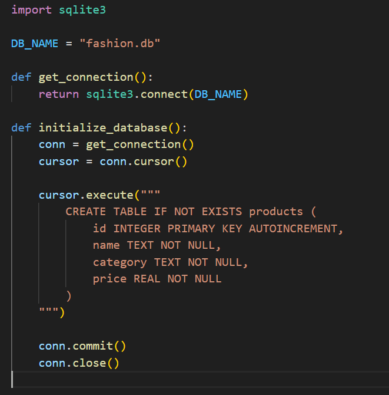
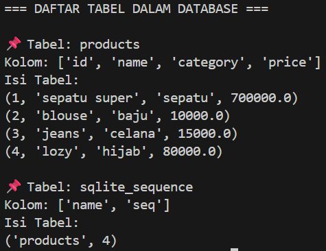
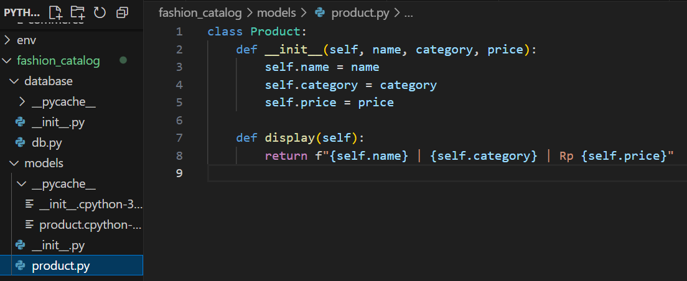
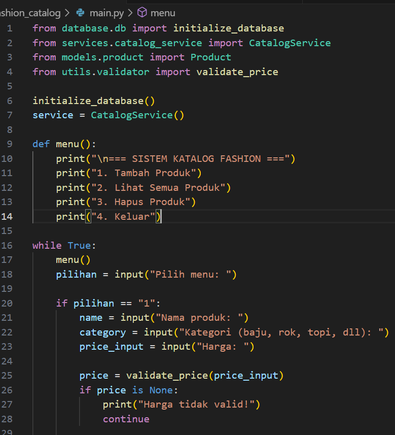
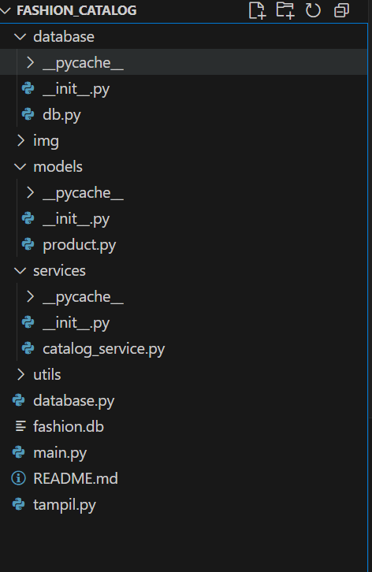
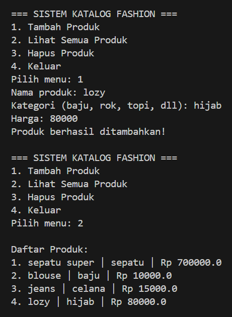

## 📚 Catalog Fashion System (Python + SQLite)

Sistem Manajemen Katalog Fashion berbasis Python, menggunakan SQLite sebagai database dan struktur program modular.
Proyek ini dirancang untuk memenuhi seluruh ketentuan UAS Python:

- Menggunakan Database SQLite ✔
- Menggunakan OOP (Object-Oriented Programming) ✔
- Menggunakan Modul & Package ✔
- Menggunakan Percabangan (if–else) ✔
- Menggunakan Perulangan (for / while) ✔
- Dapat dijalankan sebagai aplikasi CLI (Terminal) ✔

## 🚀 Cara Menjalankan Proyek
1. Clone atau Download Project
   **Clone repository ini**
   ```bash
   https://github.com/putri09andriyani-alt/UAS-PYTHON.git
   cd UAS-PYTHON
   ```


3. Install Virtual Environment (Opsional)
    bash
    ```bash
    python -m venv venv
    ```
## Aktifkan virtual environment:
Windows 
```bash
    venv\Scripts\activate
```
Mac / Linux
```bash
    source venv/bin/activate
```
   
3. Jalankan Program
      bash
   ```bash
    python main.py
   ```
   
Aplikasi berjalan dalam mode terminal/command prompt.


## Screenshot Struktur Database dan isi Tabel database
|         Screenshot Struktur Database dan isi Tabel database                          |
|------------------------------------|-----------------------------------------|
|  |  |


## Screenshot OOP 



## Screenshot Perulangan dan Percabangan 


## Screenshot Modul Package

 

## Screenshot Output
 
